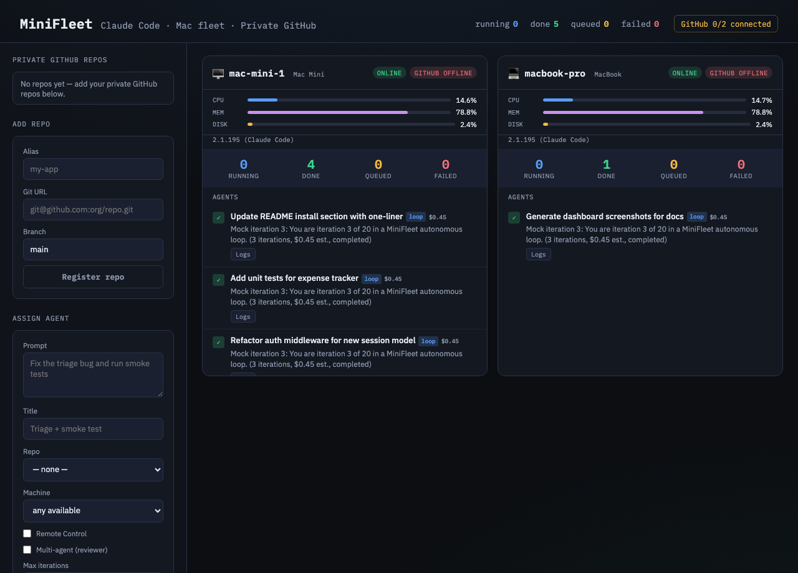
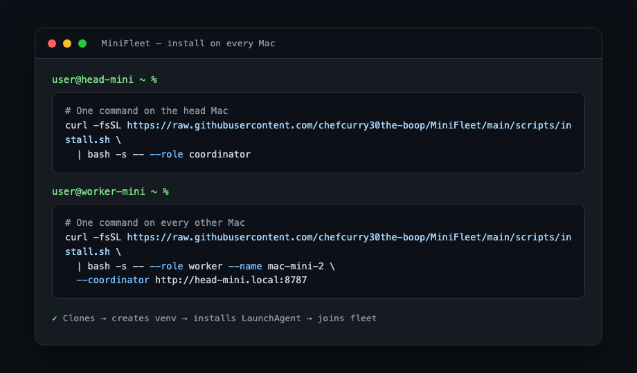

# MiniFleet

Run **Claude Code** agents across your **Mac fleet** — Mac Minis, MacBooks, Mac Studios, any Mac. Assign work from your laptop, unplug, and come back to a dashboard showing what's running and what's done.

## The three Claude layers

| Layer | What it is | MiniFleet role |
|---|---|---|
| **Claude Code** | CLI (`claude`) — runs agents headless on each Mac | MiniFleet dispatches jobs via `claude -p` or playbook loops |
| **Remote Control** | Connect from phone/browser to sessions on your Mac | Per-job `--remote` flag, or always-on `claude remote-control` server on each mini |
| **Cowork** | Claude Desktop app tab — computer use (click, type, navigate) | Run Claude Desktop on each mini; pair with Dispatch from your phone for ad-hoc tasks |

```
┌─────────────┐     assign jobs      ┌──────────────────┐
│ Your laptop │ ──────────────────►  │  Coordinator     │
│  minifleet  │     view dashboard   │  (head Mac)      │
└─────────────┘ ◄──────────────────  │  :8787 + SQLite  │
        │                            └────────┬─────────┘
        │  claude.ai/code (Remote Control)            │
        └─────────────────────────────────────────────┘
                                              │
                    ┌─────────────────────────┼─────────────────────────┐
                    ▼                         ▼                         ▼
              mac-mini-1               macbook-pro              mac-studio-1
              (always-on)              (portable worker)        (optional)
```

1. **Coordinator** — one always-on Mac (usually a Mac Mini or Mac Studio) runs the API + dashboard.
2. **Workers** — any Mac can join: Mac Minis, MacBooks, iMacs. Each runs a daemon that claims jobs and executes Claude Code.
3. **Your laptop** — optional control surface via CLI or browser. Can also be a worker if plugged in.

## Supported machines

| Machine | Role | Notes |
|---------|------|-------|
| Mac Mini | Coordinator + worker | Best as always-on head node |
| MacBook Pro/Air | Worker (or coordinator for testing) | Great when docked; assign jobs while plugged in |
| Mac Studio / iMac | Coordinator or worker | More RAM for many parallel agents |
| Any Mac | Worker | Auto-detected on register (`macbook`, `mac-mini`, etc.) |

Detect your machine:
```bash
./scripts/detect-device.sh
# Device:     MacBook (macbook)
# Suggested:  MINIFLEET_NODE_NAME=macbook-yourhostname
```

## Private GitHub

Register your private repos once on the coordinator. Every worker Mac clones them to `~/.minifleet/repos/<alias>` and pulls before each job.

### 1. Auth on each Mac

**SSH deploy key (recommended):**
```bash
./scripts/setup-github.sh --ssh
# Add the printed public key to GitHub → repo → Settings → Deploy keys
```

**Or HTTPS token:**
```bash
GITHUB_TOKEN=ghp_xxx ./scripts/setup-github.sh --token
```

### 2. Register repos

From your laptop or the **dashboard sidebar**:

```bash
minifleet repo add my-app git@github.com:your-org/your-private-repo.git --branch main
minifleet repo list
```

Or open the dashboard → **Add repo** form.

### 3. Assign work against a repo

```bash
minifleet assign "Fix triage bug and smoke test" \
  --repo my-app \
  --node mac-mini-1 \
  --title "Triage + smoke"
```

The worker pulls latest `main` from your private GitHub, then runs Claude Code in that directory.

## Dashboard

Open `http://YOUR-HEAD-MAC.local:8787` (replace with your coordinator's hostname — run `hostname -s` on the head Mac) or `minifleet dashboard`.

If the `.local` address doesn't load, use the head Mac's LAN IP address instead (the installer prints it, e.g. `http://192.168.1.34:8787`). Some networks block mDNS/Bonjour, which makes `.local` names fail.



The dashboard shows:
- **Fleet totals** — running / done / queued / failed
- **GitHub status** — how many machines are connected to private GitHub
- **Repo registry** — your private repos + add form
- **Assign panel** — queue Claude Code jobs from the browser
- **Per-machine cards** — device type (MacBook / Mac Mini), agent counts, repo sync, live jobs

## Setup guides

Detailed walkthroughs — start here if you're wiring up real machines:

| Guide | When to use |
|-------|-------------|
| **[docs/SETUP-TWO-MACS.md](docs/SETUP-TWO-MACS.md)** | Two MacBooks — test the full flow before scaling up |
| **[docs/SETUP-MAC-MINIS.md](docs/SETUP-MAC-MINIS.md)** | 5 always-on Mac Minis + your MacBook as control surface |
| **[docs/WORKFLOW.md](docs/WORKFLOW.md)** | What happens after you assign a job (loops, guardrails, multi-agent) |

## Quick start

### 1. Prerequisites (each Mac)

- macOS (Mac Mini, MacBook, Mac Studio, iMac — any Mac)
- Python 3.11+
- [Claude Code](https://code.claude.com) installed (`claude --version`)
- Logged in: run `claude` once and `/login` (Pro, Max, Team, or Enterprise — not API key)
- For Cowork / computer use: [Claude Desktop](https://claude.com/download) with Accessibility + Screen Recording permissions

### 2. One-command install



Run a single command on the head Mac (the one that stays on):

```bash
curl -fsSL https://raw.githubusercontent.com/chefcurry30the-boop/MiniFleet/main/scripts/install.sh \
  | bash -s -- --role coordinator
```

Then run one command on **each** Mac Mini / MacBook / Studio you want as a worker (replace `head-mini` with your head Mac's hostname or LAN IP; use the IP if `.local` doesn't resolve on your network):

```bash
curl -fsSL https://raw.githubusercontent.com/chefcurry30the-boop/MiniFleet/main/scripts/install.sh \
  | bash -s -- --role worker --name mac-mini-2 --coordinator http://head-mini.local:8787
```

What it does:
1. Clones/updates `MiniFleet` into `~/MiniFleet`
2. Creates an isolated Python venv at `~/MiniFleet/.venv`
3. Installs the package into the venv
4. Registers the right macOS LaunchAgent (`com.minifleet.coordinator` or `com.minifleet.worker`)
5. Starts the service and joins the fleet

Dashboard: `http://YOUR-HEAD-MAC.local:8787` — if `.local` doesn't load, use the head Mac's LAN IP (printed by the installer, e.g. `http://192.168.1.34:8787`).

### 3. Manual install (optional)

If you prefer the original steps:

**Coordinator:**
```bash
git clone https://github.com/chefcurry30the-boop/MiniFleet.git ~/MiniFleet
cd ~/MiniFleet
pip3 install -e .
./scripts/setup-coordinator.sh
```

**Each worker:**
```bash
git clone https://github.com/chefcurry30the-boop/MiniFleet.git ~/MiniFleet
cd ~/MiniFleet
pip3 install -e .

HEAD=http://YOUR-HEAD-MAC.local:8787
MINIFLEET_NODE_NAME=mac-mini-1 MINIFLEET_COORDINATOR=$HEAD ./scripts/setup-worker.sh
```

Your MacBook can be a worker while docked — assign jobs, close the lid (if configured to not sleep on power), agents keep running.

**Optional — Remote Control hub** (steer from phone without assigning via MiniFleet):

```bash
MINIFLEET_NODE_NAME=mac-mini-1 ./scripts/setup-remote-control.sh
```

Then open [claude.ai/code](https://claude.ai/code) and look for sessions prefixed `mac-mini-1-*`.

### 4. From your laptop

```bash
cd ~/MiniFleet
pip install -e .
export MINIFLEET_COORDINATOR=http://YOUR-HEAD-MAC.local:8787

# Queue a Claude Code job
minifleet assign "Fix the triage bug and run smoke tests" \
  --node mac-mini-1 \
  --repo ~/projects/my-app \
  --title "Triage bug + smoke test"

# With Remote Control — steer from phone while it runs
minifleet assign "Refactor auth middleware" \
  --node mac-mini-2 \
  --repo ~/projects/my-app \
  --remote

minifleet status
minifleet dashboard
```

Unplug your laptop. Claude Code keeps running on the minis. Reconnect and open the dashboard:

> **mac-mini-1** · 4 running · 2 done  
> ✓ Triage bug + smoke test — fixed null check, smoke tests pass

## Claude Cowork (desktop)

Cowork runs in the **Claude Desktop** app, not the CLI. For tasks that need computer use (clicking through apps, browser, PDF export, etc.):

1. Install Claude Desktop on the Mac Mini
2. Enable **Computer use** in Settings
3. Use the **Cowork** tab for delegated desktop work
4. From your phone: use **Dispatch** in the Claude app to send tasks to the paired Desktop

MiniFleet handles the **Code** side (repo work, tests, refactors). Cowork handles the **GUI** side. They complement each other on the same machine.

## Remote Control modes

| Mode | Command | Use when |
|---|---|---|
| Per-job | `minifleet assign ... --remote` | You want to steer one specific job from claude.ai/code |
| Always-on hub | `./scripts/setup-remote-control.sh` | You want a standing RC server on each mini (`--capacity 4`, git worktrees) |
| Manual | `claude remote-control` | Quick one-off session from SSH |

Remote Control requires Claude Code v2.1.51+ and a claude.ai subscription.

## Configuration

| Variable | Default | Description |
|---|---|---|
| `MINIFLEET_COORDINATOR` | `http://127.0.0.1:8787` | Coordinator URL |
| `MINIFLEET_NODE_NAME` | — | Worker name (required on workers) |
| `MINIFLEET_MAX_CONCURRENT` | `0` (unlimited) | Cap agents per mini; set e.g. `4` to limit |
| `MINIFLEET_PERMISSION_MODE` | `auto` | Claude permission mode (`auto`, `acceptEdits`, `bypassPermissions`) |
| `MINIFLEET_BACKGROUND` | — | Set to `1` to use `claude --background` instead of blocking `-p` |
| `MINIFLEET_DATA` | `~/.minifleet` | Logs + SQLite path |
| `MINIFLEET_MOCK` | — | Set to `1` for mock agents (testing) |
| `MINIFLEET_CLAUDE` | `claude` in PATH | Path to Claude Code binary |
| `MINIFLEET_NOTIFY_MACOS` | `1` | macOS notification on job complete/fail (coordinator host) |
| `MINIFLEET_WEBHOOK_URL` | — | POST JSON to this URL on job events (phone, Slack, etc.) |
| `MINIFLEET_NOTIFY_ON` | `completed,failed,cancelled` | Comma-separated events to notify on |

For unattended Mac Minis, set `MINIFLEET_PERMISSION_MODE=auto` (or `bypassPermissions` if you trust the environment).

## Job control

```bash
minifleet cancel <agent-id>          # stop queued or running job
minifleet logs <agent-id>            # view logs (no SSH)
minifleet logs <agent-id> --follow   # live tail from coordinator
```

Dashboard: click any agent → live log viewer + Cancel button. Node cards show CPU / RAM / disk.

## Development / local test

```bash
pip install -e .

# Terminal 1 — coordinator
python -m minifleet.coordinator.main

# Terminal 2 — mock worker
MINIFLEET_NODE_NAME=mac-mini-1 MINIFLEET_MOCK=1 python -m minifleet.worker.main

# Terminal 3
minifleet assign "Triage bug fixed and smoke tested" --node mac-mini-1
minifleet status
open http://127.0.0.1:8787
```

## Logs

- Coordinator: `~/.minifleet/coordinator.log`
- Worker: `~/.minifleet/worker.log`
- Remote Control: `~/.minifleet/remote-control.log`
- Agent output: `~/.minifleet/logs/<agent-id>.log`

## Full job workflow

See **[docs/WORKFLOW.md](docs/WORKFLOW.md)** for the complete lifecycle when a job is assigned — loop phases, multi-agent, guardrails, and diagrams.

## Setup guides (detailed)

- **[Connecting two MacBooks](docs/SETUP-TWO-MACS.md)** — MacBook A (head) + MacBook B (worker)
- **[Mac Mini fleet](docs/SETUP-MAC-MINIS.md)** — 5 Mac Minis running + MacBook connects to dashboard
