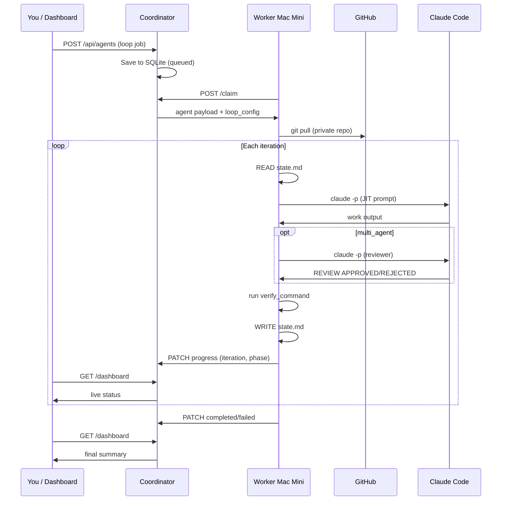

# MiniFleet Job Workflow

This document describes the **entire lifecycle** of a job from assignment to completion, including all four loop architecture phases.

---

## Architecture overview

```
┌──────────────┐     assign job      ┌─────────────────────┐
│ Laptop /     │ ─────────────────► │ Coordinator         │
│ Dashboard    │ ◄───────────────── │ (head Mac :8787)     │
└──────────────┘   dashboard/API    │ SQLite fleet.db     │
                                    └──────────┬──────────┘
                                               │
                         ┌─────────────────────┼─────────────────────┐
                         ▼                     ▼                     ▼
                   mac-mini-1            mac-mini-2            mac-mini-3
                   worker daemon         worker daemon         worker daemon
                         │                     │                     │
                         ▼                     ▼                     ▼
                   git pull              git pull              git pull
                   playbook loop         playbook loop         playbook loop
                   claude -p × N         claude -p × N         claude -p × N
```

---

## Phase map

| Phase | Name | What MiniFleet does |
|-------|------|---------------------|
| **1** | Playbook loop | Read → Work → Verify → Write with `state.md` on disk |
| **2** | JIT context | Each iteration gets minimal, focused prompt (Shopify pattern) |
| **3** | Guardrails | max iterations, timeout, cost cap, completion signal |
| **4** | Multi-agent | Worker agent + Reviewer agent per iteration |

---

## Step-by-step: when you assign a job

### 1. You assign work

**CLI:**
```bash
minifleet assign "Fix triage bug and run smoke tests" \
  --repo my-app \
  --node mac-mini-1 \
  --title "Triage + smoke" \
  --verify "npm test" \
  --max-iterations 20 \
  --multi-agent
```

**Dashboard:** Sidebar → Assign agent form → Queue agent

**API:** `POST /api/agents` with body:
```json
{
  "prompt": "Fix triage bug and run smoke tests",
  "repo": "my-app",
  "node_name": "mac-mini-1",
  "title": "Triage + smoke",
  "loop": true,
  "loop_config": {
    "max_iterations": 20,
    "verify_command": "npm test",
    "multi_agent": true
  }
}
```

### 2. Coordinator queues the job

- Validates repo is registered (`minifleet repo add ...`)
- Writes row to `agents` table: `status=queued`
- Stores `loop_config` JSON (iterations, verify, multi-agent, cost cap, etc.)
- Job visible on dashboard immediately

### 3. Worker claims the job

Every ~5 seconds each Mac Mini worker polls:
```
POST /api/nodes/{node_id}/claim
```

- Coordinator assigns job to that mini if targeted (or any idle mini)
- Status → `running`
- Worker receives full agent payload including `loop_config`

### 4. Worker syncs private GitHub

If `--repo my-app` was set:
```
git pull origin main  →  ~/.minifleet/repos/my-app
```

Dashboard shows commit SHA under that mini's repo sync section.

### 5. Loop workspace created

On the worker Mac Mini:
```
~/.minifleet/jobs/{agent-id}/
  state.md          ← persistent memory (Ralph loop)
  checklist.md      ← verification checklist
  prompt.md         ← original objective
  iterations/
    001-work.log
    001-verify.txt
    001-review.log   (if multi-agent)
    002-work.log
    ...
```

### 6. Loop iterations (Phases 1–4)

Each iteration runs this cycle:

```
┌─────────────────────────────────────────────────────────────┐
│  ITERATION N                                                │
│                                                             │
│  ┌─────────┐   ┌─────────┐   ┌─────────┐   ┌─────────┐    │
│  │  READ   │ → │  WORK   │ → │ VERIFY  │ → │  WRITE  │    │
│  │ state.md│   │ claude  │   │ npm test│   │ state.md│    │
│  └─────────┘   └────┬────┘   └─────────┘   └─────────┘    │
│                     │                                       │
│              ┌──────▼──────┐  (Phase 4, optional)           │
│              │  REVIEWER   │                                │
│              │  claude -p  │                                │
│              │ APPROVED /  │                                │
│              │ REJECTED    │                                │
│              └─────────────┘                                │
│                                                             │
│  STOP IF:                                                   │
│    • MINIFLEET_TASK_COMPLETE × 2 consecutive + verify pass  │
│    • max_iterations reached                                 │
│    • max_duration exceeded                                  │
│    • cost_cap exceeded                                      │
│    • work agent fails                                       │
└─────────────────────────────────────────────────────────────┘
```

#### Phase 1 — Read (playbook)
- Load `state.md`, `checklist.md`
- Dashboard: `loop_phase=read`, `iteration=N`

#### Phase 2 — Work (JIT prompt)
- Build **minimal** iteration prompt:
  - Playbook (from `.minifleet/playbooks/` or bundled `default.md`)
  - Current state (truncated)
  - Last verify failure only (not full history)
  - Single objective
- Run: `claude -p --permission-mode auto "<jit prompt>"`
- Fresh context window each iteration (no degradation)
- Dashboard: `loop_phase=work`

#### Phase 3 — Verify (guardrails)
- Run `verify_command` if set (e.g. `npm test`)
- Check for completion signal in worker output
- Track consecutive `MINIFLEET_TASK_COMPLETE` signals
- Track estimated cost (`iterations × $0.15` default)
- Dashboard: `loop_phase=verify`

#### Phase 4 — Review (multi-agent, optional)
- If `--multi-agent`:
  - Second `claude -p` as reviewer
  - Must output `REVIEW: APPROVED` or `REVIEW: REJECTED`
  - Rejected → next iteration without counting as complete
- Dashboard: `loop_phase=review`

#### Write
- Agent updates `state.md` and `checklist.md`
- Worker PATCHes coordinator with progress
- Dashboard: `iteration=N/M`, `loop_phase=write`, `estimated_cost_usd`

### 7. Loop completes

**Success when:**
- Worker outputs `MINIFLEET_TASK_COMPLETE` **2 times in a row** (configurable)
- AND verify command passes

**Failure when:**
- Work agent errors
- max_iterations / timeout / cost_cap hit without completion

Coordinator updates:
```
status=completed|failed
summary="Fixed triage.ts ... (5 iterations, $0.75 est., completed)"
```

### 8. You reconnect (laptop unplugged is fine)

Open dashboard: `http://YOUR-HEAD-MAC.local:8787` (hostname of the coordinator Mac)

See:
```
mac-mini-1  ● online  GitHub SSH
  2 running · 5 done

  ↻ 7/20 work   Triage + smoke
  ✓ Auth refactor (3 iterations, $0.45 est., completed)
```

---

## Single-shot mode (no loop)

Use `--no-loop` for one `claude -p` and done:

```bash
minifleet assign "Quick question about this repo" --no-loop --repo my-app
```

---

## Playbooks

Custom playbooks go in your repo:

```
my-app/
  .minifleet/playbooks/
    default.md      ← worker instructions
    reviewer.md     ← optional reviewer instructions
```

Or globally: `~/.minifleet/playbooks/default.md`

Bundled default: `minifleet/playbooks/default.md`

---

## Configuration reference

| Field | Default | Description |
|-------|---------|-------------|
| `loop` | `true` | Enable playbook loop |
| `max_iterations` | `20` | Max loop cycles |
| `max_duration_seconds` | `7200` | 2 hour timeout |
| `completion_signal` | `MINIFLEET_TASK_COMPLETE` | Agent outputs when done |
| `completion_threshold` | `2` | Consecutive signals required |
| `verify_command` | none | Shell command (must exit 0) |
| `playbook` | `default` | Playbook name |
| `multi_agent` | `false` | Enable reviewer |
| `cost_cap_usd` | none | Stop at estimated cost |
| `cost_per_iteration_usd` | `0.15` | Cost estimate per iteration |

---

## Environment variables (workers)

| Variable | Purpose |
|----------|---------|
| `MINIFLEET_COORDINATOR` | Head mini URL |
| `MINIFLEET_NODE_NAME` | e.g. `mac-mini-1` |
| `MINIFLEET_PERMISSION_MODE` | `auto` for unattended |
| `MINIFLEET_MOCK` | `1` for testing without Claude |
| `GITHUB_TOKEN` | Private repo HTTPS auth |

---

## Logs

| Path | Contents |
|------|----------|
| `~/.minifleet/coordinator.log` | API server |
| `~/.minifleet/worker.log` | Worker daemon |
| `~/.minifleet/jobs/{id}/state.md` | Loop memory |
| `~/.minifleet/jobs/{id}/iterations/*.log` | Per-iteration Claude output |
| `~/.minifleet/logs/{id}.log` | Single-shot jobs only |

---

## Mermaid: full job sequence



---

## Quick test (no Claude required)

```bash
# Terminal 1
MINIFLEET_DATA=/tmp/mf-test python -m minifleet.coordinator.main

# Terminal 2
MINIFLEET_DATA=/tmp/mf-test MINIFLEET_NODE_NAME=mac-mini-1 MINIFLEET_MOCK=1 \
  python -m minifleet.worker.main

# Terminal 3
MINIFLEET_COORDINATOR=http://127.0.0.1:8787 MINIFLEET_MOCK=1 \
  minifleet assign "Test loop" --node mac-mini-1 --verify "true"

open http://127.0.0.1:8787
```

Mock completes in 2 iterations with verify pass.
